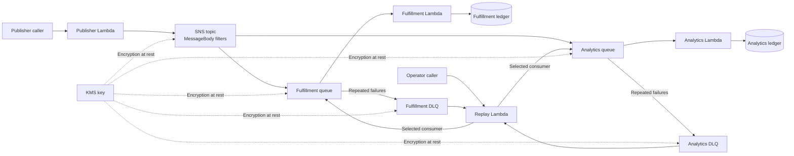

# PulseRoute

### A cloud infrastructure benchmark for LLM agents


**Can an AI agent build a working cloud deployment—and recover it when infrastructure, permissions, and local state break?**

PulseRoute evaluates that question through an order-event pipeline built with Lambda, SNS, SQS, DynamoDB, IAM, and KMS. An agent receives a public contract and fixed application images, then implements deployment and teardown automation using Terraform or OpenTofu.

The evaluator checks live behavior, resource configuration, security boundaries, and recovery under injected faults. A successful initial deployment is only the beginning.

[Task instructions](task2-dev-cl/instruction.md) · [Runtime contract](task2-dev-cl/environment/workspace/contracts/runtime.md) · [Reference solution](task2-dev-cl/solution/) · [Verifier](task2-dev-cl/tests/verify.py) · [Design rationale](task2-dev-cl/reasoning.md)

## What this project demonstrates

- **LLM evaluation engineering:** executable task contracts, weighted scoring, capability gates, and regression checks for the evaluator itself.
- **Agent reliability:** repeated deployment, compound drift repair, and adoption of live resources after missing or corrupted Terraform state.
- **Distributed systems:** selective delivery, tenant-scoped idempotency, partial batch failures, and dead-letter replay.
- **Cloud security:** narrow IAM permissions, KMS service restrictions, isolated callers, and removal of unauthorized access.
- **Failure analysis:** reports that identify individual failed checks and distinguish an incomplete verifier run from a valid scored trial.

## Architecture



| Component | Responsibility |
| --- | --- |
| Publisher | Validate requests and publish order events to SNS. |
| SNS subscriptions | Filter the message body so each consumer receives only eligible events. |
| Fulfillment and Analytics | Process separate queues and conditionally record receipts in separate DynamoDB tables. |
| Dead-letter queues | Preserve repeatedly failing messages for recovery. |
| Replay | Return messages from one selected DLQ to its main queue without disturbing the other consumer. |
| IAM and KMS | Restrict each caller and service to the permissions required for its role. |

Four Lambda functions use three fixed application images: Publisher, the shared worker image, and Replay. The agent provisions their infrastructure; the application code is supplied by the benchmark.

## Evaluation design

The benchmark contains **17 scored checks totaling 100 points**. The verifier invokes the submitted scripts through a separate runner and examines the resulting deployment through the local AWS APIs.

| Area | Example checks |
| --- | --- |
| Functional correctness | Routing boundaries, concurrent duplicate events, tenant isolation, and poison-message recovery. |
| Infrastructure configuration | Correct images and environments, queue retention, redrive policies, batching, and concurrency. |
| Security | Caller isolation, execution-role permissions, KMS policy semantics, and private local secret files. |
| Deployment recovery | Repeated deployment, lost state, truncated state, deleted resources, and a key scheduled for deletion. |
| Convergence and ownership | Remove extra access and mappings; preserve unrelated resources and deployments with overlapping prefixes. |
| Cleanup | Repeated teardown, teardown without state, and fresh deployment after destruction. |

Two capability gates prevent a high score from hiding a fundamental failure:

- A **selective delivery** failure caps the score at **40/100**.
- A **caller isolation** failure caps the score at **60/100**.

The verifier writes `report.json`, `reward.json`, and `reward.txt` under `/logs/verifier/`. If verification exits before producing a valid result, `invalid.json` marks the trial as invalid; a fallback zero reward should not be interpreted as an ordinary model failure.

### Faults go beyond a simple redeploy

The evaluator can disconnect a worker, delete a subscription or function, alter queue settings, enable ledger expiry, add unauthorized policies, attach mappings to function aliases, and redirect a KMS alias to an unrelated key. Deployment automation must restore the contract while preserving surviving resource identities, receipts, and queued messages.

Security checks combine live API behavior with the [KMS policy evaluator](task2-dev-cl/tests/policy_eval.py). This matters because a local emulator does not enforce every AWS permission rule.

## Repository layout

```text
PulseRoute/
├── README.md
└── task2-dev-cl/
    ├── instruction.md          # Agent-facing task
    ├── reasoning.md            # Design and scoring rationale
    ├── task.toml               # Harness configuration and resource budgets
    ├── environment/
    │   ├── application/        # Supplied Lambda image sources
    │   ├── workspace/contracts/ # Runtime contract and manifest schema
    │   ├── Dockerfile          # Agent environment
    │   └── docker-compose.yaml
    ├── solution/               # Reference deployment and teardown automation
    │   ├── deploy.sh
    │   ├── destroy.sh
    │   ├── infra/
    │   └── scripts/
    └── tests/
        ├── verify.py          # Scored end-to-end checks
        ├── policy_eval.py     # KMS policy analysis
        ├── test_verifier_regressions.py
        ├── runtime/runner.py  # Separate submission execution service
        └── docker-compose.yaml
```

## Run the reference evaluation locally

### Requirements

- A Linux Docker engine and Docker Compose v2. On Windows, use Docker Desktop with Linux containers and run the commands from WSL.
- Access to the Docker socket for the local Lambda execution environment.
- Network access to download the pinned images and build dependencies.

Cloud operations run against **Floci**, a local AWS emulator. A production AWS account or production credentials are not required. The bootstrap service creates the local deployment credentials.

The following commands use the standalone **verifier stack** and the included reference solution. They do not launch an LLM.

```bash
git clone https://github.com/Shulinagarwal/PulseRoute.git
cd PulseRoute/task2-dev-cl

# Start a fresh evaluation stack, including the runner and local AWS services.
docker compose -p pulseroute-demo -f tests/docker-compose.yaml up -d --build --wait main

# Supply the reference implementation as the submission to evaluate.
docker compose -p pulseroute-demo -f tests/docker-compose.yaml cp solution/. main:/workspace/submission/

# Execute the evaluator and inspect its report.
docker compose -p pulseroute-demo -f tests/docker-compose.yaml exec -T main bash /tests/test.sh
docker compose -p pulseroute-demo -f tests/docker-compose.yaml exec -T main cat /logs/verifier/report.json
```

Save the reports before removing the stack:

```bash
docker compose -p pulseroute-demo -f tests/docker-compose.yaml cp main:/logs/verifier/ ./evaluation-results/
docker compose -p pulseroute-demo -f tests/docker-compose.yaml down --volumes --remove-orphans
```

Use a fresh Compose project or remove the previous stack's volumes before another independent evaluation. The evaluator creates resources, injects destructive drift, and tears down deployments within its local account.

The agent-facing `environment/docker-compose.yaml` includes harness-specific proxy and certificate settings. For an agent trial, use a compatible Dev Cloud/Harbor harness with [task.toml](task2-dev-cl/task.toml) and its expected network configuration.

### Run verifier regression tests

From `task2-dev-cl/`, in a Python environment with the verifier dependencies installed:

```bash
python -m pip install boto3 jsonschema
python -m unittest discover -s tests -p 'test_verifier_regressions.py'
```

These focused tests exercise evaluator behavior without launching model trials. They complement the full container-based evaluation.

## Submission interface

An agent implements the following under `/workspace/submission/`:

```text
submission/
├── deploy.sh
├── destroy.sh
├── manifest.json       # Generated by a successful deploy
└── infra/
    └── *.tf
```

Both scripts operate on the deployment selected by `PULSEROUTE_PREFIX`, have a 900-second execution budget, and must support multiple independent deployments from the same submission directory. Helper scripts may also live in the submission. Every scored resource must be represented in readable Terraform/OpenTofu state.

The [runtime contract](task2-dev-cl/environment/workspace/contracts/runtime.md) and [manifest schema](task2-dev-cl/environment/workspace/contracts/manifest.schema.json) define the complete requirements.

## Interpreting results

A failing check is evidence to investigate. Trace it back to the public requirement, submitted implementation, and execution logs before attributing it to the model. Several failed checks may share one underlying defect, and provider or emulator errors can affect later phases.

The local emulator makes trials reproducible and accessible, but results should not be treated as certification of a production AWS deployment. This repository focuses on **LLM agent evaluation, infrastructure correctness, and recovery reliability**.

---

Created by [Shulin Agarwal](https://github.com/Shulinagarwal).
