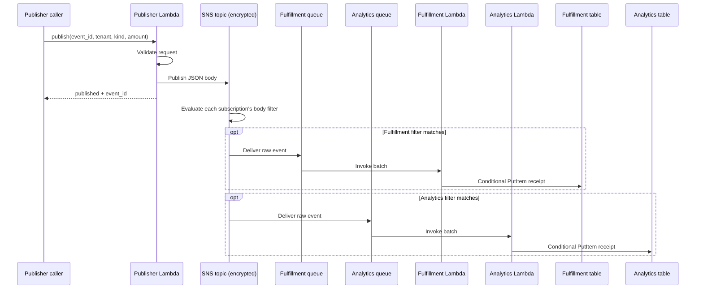
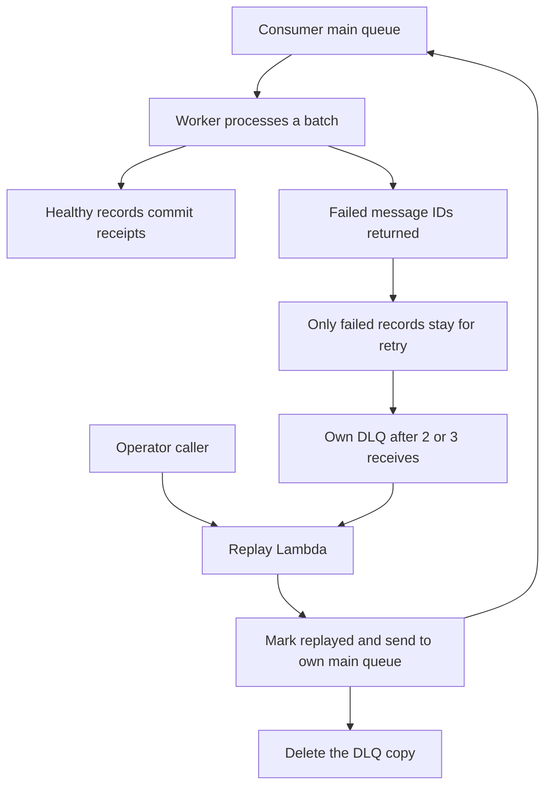
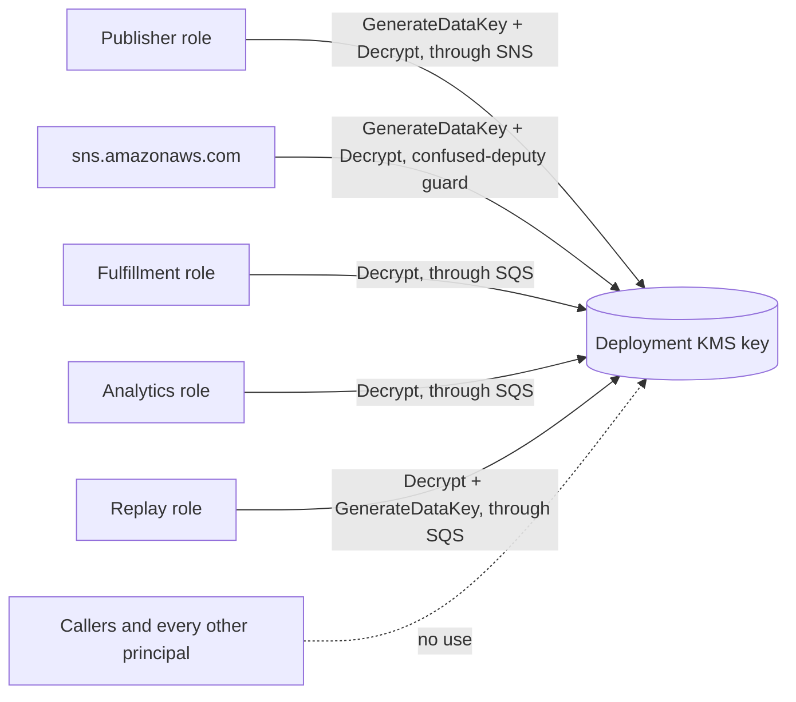

# PulseRoute

## Introduction

PulseRoute is fundamentally an order event pipeline where the publisher sends
an order event, the SNS routing rules determine which of two independent
consumers process the message, each consumer maintains its separate log of
successful deliveries, and the operator is able to reroute any failed message
from the appropriate dead-letter queue. The Fulfillment component processes
eligible shop orders and Analytics supports a larger group of shop and lab
events. Well, of course,I realize that it looks like much infrastructure to
support one order event.But it is on purpose since I try to check whether the
model can create messaging infrastructure that is encrypted and exactly least
privilege as required by AWS and that maintains its correctness throughout
lifecycle events that are typical for a real development team.

One must know the functionalities of the existing application. The application comes as four images,since each service requires an individual execution role and individual permissions:

1. **Publisher image:** checks a JSON publish request and publishes an order
   event to a dedicated and KMS-encrypted SNS topic. It runs as a Lambda function
   which is called by the publisher caller.
2. **Worker image, as Fulfillment:** receives batches from the Fulfillment queue
   and writes one receipt for each consumer, tenant and event to its individual
   DynamoDB table, reporting only the failed records to Lambda.
3. **Worker image, as Analytics:** the same image as above but deployed as another
   Lambda with another queue, table, execution role and routing rules. It must work
   even when Fulfillment stops working.
4. **Replay image:** gets messages from a dead-letter queue of the chosen
   consumer, marks the messages as replayed and sends them back to the consumer's
   primary queue while deleting dead-letter queues. It runs as a Lambda function
   which is called by the operator.

The four functions do not imply four constantly running containers.The functions Publisher and Replay are called by callers with IAM credential and the workers are triggered through SQS event source mappings.The images depend on environment variables for their configuration, so the challenge is in deployment and configuration of these images, not in writing code.Everything must be declared in Terraform/OpenTofu, according to the instructions provided in `instruction.md`and`/workspace/contracts/runtime.md`.

There are two types of challenges in this assignment.The first typw, the lifecycle requirements, check if the model creates automation that will survive the initial `terraform apply`.The encryption, retention and concurrency requirements have their results formulated and to satisfy them precisely, one needs exact information on how AWS behaves, which is not enforced by Floci,the local AWs emulator.

## Infrastructure Used

| Service | Role in PulseRoute | Why the design needs it |
| --- | --- | --- |
| Lambda (container images) | Runs Publisher, Fulfillment, Analytics and Replay with four distinct execution roles | Four independently invoked services make every privilege boundary observable |
| KMS customer managed key (rotating, with an alias) | Encrypts the topic and all four queues | SNS can only deliver into encrypted queues under a customer managed key whose policy admits it; the key policy and role grants form the encryption boundary |
| SNS standard topic and topic policy | Receives validated order events; only the Publisher role may publish | One publication point for two independent consumers |
| SNS to SQS subscriptions (raw, `MessageBody` filters) | Route events by tenant prefix, order kind and inclusive amount bounds | Filtering at SNS means a non-matching event never reaches a worker |
| SQS main queues (6-day retention) | Buffer each consumer's work independently | A failing consumer must not block its peer; the retention keeps the dead-letter replay window intact |
| SQS dead-letter queues (14-day retention, redrive allow policy) | Hold messages after their own consumer exhausts 2 or 3 receives | Recovery stays isolated per consumer, and only the owning main queue may redrive into each DLQ |
| Lambda event source mappings | Invoke workers in batches of 5 to 10 with `ReportBatchItemFailures`, at most 3 batches at a time | Healthy records complete while failed records stay for retry; the concurrency cap must never throttle |
| DynamoDB ledger tables (deletion protection, point-in-time recovery) | Store one receipt per consumer, tenant and event ID through conditional writes | The first receipt always wins, and protection forces destroy to handle the ledgers deliberately |
| IAM execution roles and queue policies | Grant exact actions on exact resources | Workers reach only their own queue and table; queue policies admit only the dedicated topic |
| IAM caller users (publisher, operator, outsider) | One access key each | Each authorized caller can invoke only its designated function, and the outsider nothing |
| Terraform/OpenTofu local state, one per deployment | Records the identities of each deployment | Repeated deploys repair drift without replacing data, and destroy removes only what it owns |

## Operational Flows

### Publication, routing and delivery

Both plans involve the source `pulseroute.orders` and an accepted order
type within `detail`. Fulfillment allows for tenants that start with `shop-` and
values between 1 and 500000; Analytics accepts tenants starting with `shop-`
and `lab-`, and values ranging from 0 to 1000000. Publisher has no attributes,
so the filters will be reading from the JSOn body.A valid publish may end up
going to either consumer or none at all, but never both.
### Duplicates, partial batch failures and replay

The writer of each worker `<consumer>:<tenant>:<event_id>` only if the record with
this key was not written yet; hence, a duplicate makes the entire first receipt
and the UUID of the same event under another tenant to become a separate receipt.
An event with `fail_consumer` continues failing within the specified worker until
replay, whereas the peer and the healthy events in the batch have to finish.
This scenario will work only if we use `ReportBatchItemFailures`; the worker
will continue normally and report the failed records, which means otherwise the
whole batch will be marked as successful, and failed messages will be lost.
Verifying worker poisons both consumers, and then it replays the lanes one by
one expecting the original fields plus `replayed=true` flag for the one, untouched
lane and zero count after emptying dead-letter queue.

### Encryption, retention and concurrency

All four queues share one KMS key that is customer managed. The publisher, SNS and Replay require `kms:Decrypt` and `kms:GenerateDataKey`, while workers require just `kms:Decrypt`.You need to be able to limit access to SNS using aws:SourceAccount or aws:SourceArn.The roles that execute must have permissions to KMS:ViaService: SNS for the publisher, and SQS for the workers and Replay.The IAM permissions must be for the ARN of the key.The key can only be managed by administrators, not for encryption or decryption.No key access is provided for callers and there are no KMS grants.
Standard SQS messages will keep their original enqueue timestamp even if they are moved to a DLQ.Main queues will then keep messages for six days and DLQs for fourteen days leaving at least eight days for replay.Concurrency is limited to three batches per each worker per event source and there is no throttling of Lambda capacity.

### Repair, idempotence and cleanup

```mermaid
flowchart TD
    PRE[Decoys sharing the first prefix: queues, topic, table, bucket, user, role, function, group, policy and KMS key] --> D1
    D1[deploy.sh with a random prefix A] --> C1[Routing, ledger, IAM, KMS and replay checks]
    C1 --> B1[deploy.sh with prefix B = A-fulfillment-random, 25 characters, from the same directory]
    B1 --> LS[Check the live configuration, then reset the runner's local files only]
    LS --> D3[deploy.sh adopts every live resource, the key through its alias]
    D3 --> TR[State file truncated as by a killed run: deploy.sh adopts everything again]
    TR --> R1[deploy.sh A again: nothing created, deleted or replaced]
    R1 --> DR[Out of band: delete a mapping and a subscription, break a filter, the worker environment, redrive, protection and encryption; delete Replay; tamper topic, queue, trust and key policies]
    DR --> DS[Out of band: a public DLQ policy, a DLQ redrive to a decoy queue, a main queue open to any redrive, shorter data-key reuse and TTL on a ledger]
    DS --> AD[Out-of-band additions: role and caller policies, a second access key, a group membership, a tap subscription, a rogue mapping, Lambda permissions on the function and on a version and an alias of it, a mapping into an alias of Analytics, a table resource policy and a KMS grant]
    AD --> KD[Key rotation off, the key alias pointed at the decoy key, then the key scheduled for deletion]
    KD --> D2[One deploy.sh repairs everything, rescues the same key through state and drains the backlog]
    D2 --> SC[Scan: every local file holding a caller secret is readable only by its owner]
    SC --> X[destroy.sh A twice: all of it gone, the key pending deletion, B untouched]
    X --> X2[destroy.sh B twice without local state]
    X2 --> V[Inventory equals the first one; decoys and their data intact]
    V --> RD[deploy.sh A again: a new deployment and key, the old key stays pending deletion]
    RD --> X3[destroy.sh A twice: the inventory equals the first one again]
```

If there is no local state or it cannot be read, deploy.sh uses the local resources with the same name and maintains the data. If there is usable state, it retrieves the KMS key from usable state instead of relying on an alias that might have been changed. Caller keys can change following loss of state and each caller must end with one working key.The name prefix is not used in cleanup.
Before drift injection, recovery tests should be performed to remove local files but not affect the live cloud./reset does this. Both tests test the initial configuration,top one worker to create a backlo and ensure that deployment continues to process without losing receipts or messages.
The reference configuration also sets ledger TTL to 0 and main-queue redrive permissions to denyAll.It also defaults Lambda's publish = false and uses AWS provider 6.50.0.All validation was successful, including recovery with publish omitted, but the intermittent provider error remains a possibility.

## Score

The Verifier (`tests/verify.py`) is a black-box solution that executes
the `deploy.sh` and `destroy.sh` scripts submitted by the user with
random prefixes in an isolated runner using the credentials of the
administrator and the caller key mentioned in the manifest file.
There are no specific Terraform resource tags required, and any valid
semantically equivalent policy works. The Verifier contains 17 tests worth a
total of 100 points.

| Check | Points | What it proves |
| --- | --- | --- |
| Encryption key least privilege | 10 | With AWS semantics: each principal can use the key only as needed to its part of the flow, and no more, roles use the key only via SNS or SQS (kms:ViaService), there are no key grants, SNS is not a target for confused deputies, the account admin is the only one who can use the key, no other IAM principal can use the key, and callers can't use it. |
| Subscriptions, policies, retention and batch configuration | 8 | Raw body-filtered subscriptions, exactly two topic subscriptions, scoped queue policies, 6-day main policy, 14-day DLQ policy, a visibility timeout of 6 x worker timeout, redrive and redrive allow policies, a closed queue for all other queues' redrive, DLQ policies without a policy, DLQ policies without a redrive, the longest re-use of data-key, and an unthrottled cap of three concurrent batches |
| Lossless multi-resource drift repair | 8 | A repeat deploy does not change any identity, but it does repair all destructive drift which includes the re-pointed key, DLQ policy and redrive, a main queue open to any redrive, ledger TTL, and rescue the same key, drain backlog and restore routing. |
| Selective delivery | 7 | Eligible events reach their consumers and excluded events create no receipts, including tenant-prefix and amount-boundary cases |
| Out-of-band addition convergence | 7 | The following policies,keys,group memberships, subscriptions, mappings, permissions, table resource policies and KMS grants are removed, even if the resources they reference are not related to the deployment, the decoy key or the other deployment: Added policies, keys, group memberships, subscriptions, mappings, permissions, table resource policies and KMS grants. |
| Caller isolation | 7 | Each caller has exactly one key and only its own invocation grant, and cannot reach SNS, queues, tables or other functions |
| State-loss adoption | 7 | From a verified live deployment before drift injection, reset only the runner's local files; deploy adopts every resource, including the key, without recreating it, keeps receipts and queued messages, and leaves each caller one working key |
| Isolated function, ledger and key topology | 6 | Correct images, environment, 15-second workers and four distinct roles; names that are valid in AWS; keyed, protected tables with point-in-time recovery and no expiry; a rotating customer managed key with an alias derived from the prefix, encrypting the topic and every queue |
| Bilateral poison and batch recovery | 6 | Both consumers dead-letter and recover their failed messages while healthy records and peer receipts stay intact |
| Independent nested-prefix deployments | 6 | A second deployment whose 25-character prefix begins with the name of one of the first deployment's resources is fully separate, and deploying it changes nothing in the first |
| Execution role least privilege | 5 | Live trust and permission policies grant only the allowed actions on the allowed resources |
| Unreadable state recovery | 5 | With its state file truncated as by a killed run, deploy still adopts every resource without recreating it, keeps receipts and queued messages, and leaves each caller one working key |
| Contract and declared state | 4 | The manifest matches the schema, and every checked identifier, mapping, subscription, role, user and the key are in local state |
| Private local secrets | 4 | Every file left in the submission, home or temporary directories that holds a caller secret key, Terraform state and backups included, is readable only by its owner |
| Complete ownership-safe cleanup | 4 | Two destroys per deployment succeed with and without state, protected tables are removed, the key is scheduled for deletion, and unrelated resources and their data remain |
| Tenant-scoped durable idempotency | 3 | Concurrent duplicates keep the first receipt while another tenant can reuse the event UUID |
| Fresh redeploy after destroy | 3 | A deploy after destroy builds a new deployment with a new key, never revives the key pending deletion, and two more destroys return the account to its first inventory |
| **Total** | **100** | |

If selective delivery fails, the score is capped at 40. If caller isolation
fails, the score is capped at 60.
